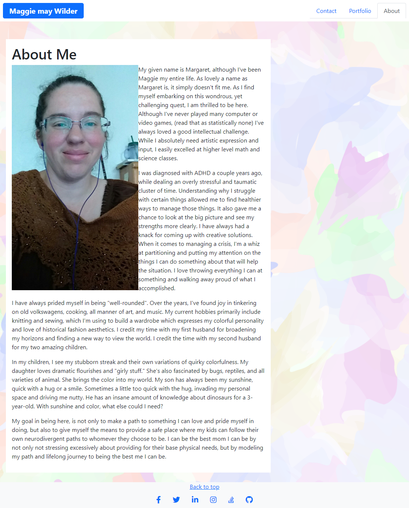
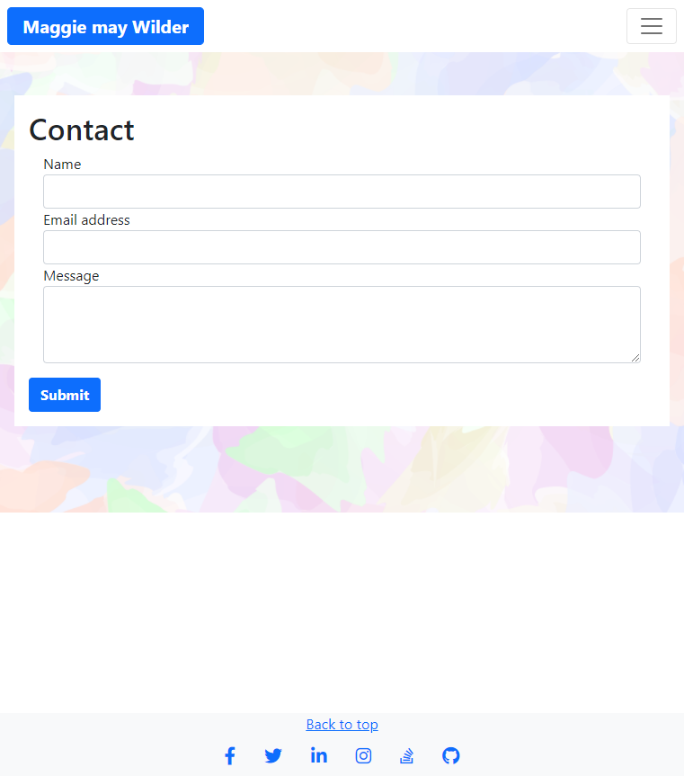

# A Profile Revisited

As I have continued my learning process, the time to revisit my portfolio has come. Given the scope of knowledge gained and experience added, I decided that starting fresh and pasting in parts that work well for me is the best option. My general frameword can be revamped and better support both existing  pieces and those I add. 

### Here is the [Github Repo]()

### Here is the [Deployed Page]()

## Screenshots

## Tech/framework used
 
Bootstrap

## Credits

(Chris Dixon)[https://chrisdixon.dev/] for general information and tutorials
(Material Design for Bootstrap)[https://mdbootstrap.com/docs] for background image and social media buttons.